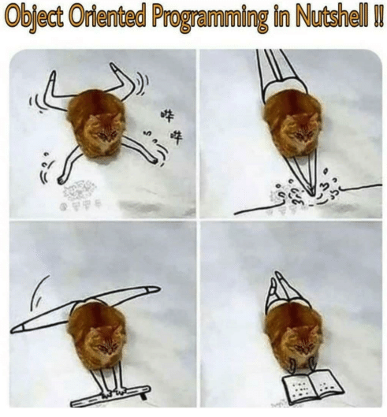

# Inheritance

## SWABTs

- [ ] Demonstrate how to inherit from a parent class.
- [ ] Demonstrate what `super` is doing.
- [ ] Understand the lookup chain.
- [ ] Investigate `self` in the child and parent classes.
- [ ] Understand how to read test errors

## Review Questions

1. How can we get one class to inherit from another?
2. What does `super` do?
3. What is a parent class/superclass?
4. What is the lookup chain (ancestors) and how can we access it?
